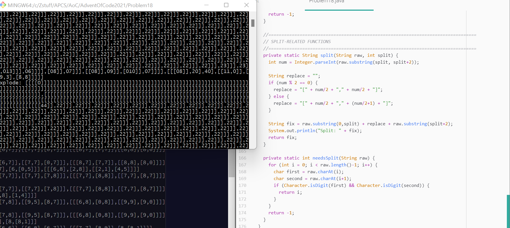

# Day 18: Snailfish
This has to have been the single most infuriating problem so far. This problem took a grand total of 7 hours to solve.

Why did it take so long to solve, you may ask?

There's a lovely key paragraph somewhere within the directions:

> During reduction, at most one action applies, after which the process returns to the top of the list of actions. For example, if **split** produces a pair that meets the **explode** criteria, that pair **explodes** before other **splits** occur.

... okay, let's start from the beginning. I'm going a bit too fast.

So yesterday, I finished [Problem 17](https://github.com/Daphne-Qin/AdventOfCode2021/tree/main/Problem17), finished the rest of my homework, then realized that I had nothing better to do. As such, I just went to Problem 18 since, well, I had nothing better to do. (I did say yesterday that I did not want to read Problem 18 until after December 25, but oh well.)

I skimmed the problem and thought, "Oh, that's actually not that bad. Seems like the length comes from the number of examples they have." I first thought to solve the problem using Strings, and it barely took any time for my code to turn into a sloppy mess. It started off neat, but then I had to code in the `explode` function, and that was just a big no-no. It kept on dying, I had to add edge cases, but in the end I got something I thought was working.

But then, I tried the slightly larger example:

```
[[[0,[4,5]],[0,0]],[[[4,5],[2,6]],[9,5]]]
[7,[[[3,7],[4,3]],[[6,3],[8,8]]]]
[[2,[[0,8],[3,4]]],[[[6,7],1],[7,[1,6]]]]
[[[[2,4],7],[6,[0,5]]],[[[6,8],[2,8]],[[2,1],[4,5]]]]
[7,[5,[[3,8],[1,4]]]]
[[2,[2,2]],[8,[8,1]]]
[2,9]
[1,[[[9,3],9],[[9,0],[0,7]]]]
[[[5,[7,4]],7],1]
[[[[4,2],2],6],[8,7]]
```

... things started to go downhill from there.

I tried adding new edge cases to the reducing algorithm. I tried changing up the order of `split` and `explode`. At some point, I got a disgusting monstrosity called "a while loop that never ends and when the String is printed it is extremely long and makes anyone looking at it want to run away". Here it is, in all its glory:



And I did mentally run away after that, so I thought, "You know what? I'm going to bed. I can deal with this tomorrow."

Cue today, and I decide to rewrite the whole thing from the bottom-up and delete my String-based code off the face of the Earth. Because why should I use Strings when I could use OOP and express each element in terms of its depth?

It took 30 minutes after that to recreate my depth-based algorithm, and then I thought, "If the split and explode algorithms aren't going to work automatically, why don't I just manually run them?"

I did that, then while running them realized that I had no idea how they were supposed to be run. When a split produced an explodable pair, but there were still other splits in the snail number, should I explode or split?

I reread the directions, and then I read that one key paragraph (that's at the top of this rant), and I got *so, so angry*. I spent ***3 hours*** debugging something since I couldn't read the directions? ***3 hours***, which I could've used on something more productive like studying for my math test on Wednesday?

Fixing my `split` algorithm took less than a minute. All I had to do was terminate after splitting once, then check if anything should be exploded. My gosh, that one roadblock could've been easily avoided if I had just read the directions.

Then I just had to code the magnitude, and then I realized I did myself a grand service by using a depth-based algorithm, since I could play off the depths to determine pairs and work my way up. Basically, no recursion needed, which made me very happy.

*Finally*, I got the answer to Part 1. I looked at Part 2, and I thought, "This'll be easy."

... I spoke too soon.

Cue me trying to figure out what in the world I did wrong and repeatedly adjusting the way each pair is determined (`j = 0`, `j = i+1`, etc.), until I decided to actually print out each snail number before I used them for Part 1 and after I used them for Part 1.

Seemed like the problem was that, by stating `SnailNumber sum = snailNums.get(0)`, I simply made a shallow copy called "sum". Thus, I was effectively using that sum for Part 2.

I then rewrote my code so it made new `SnailNumber`s for every iteration, and it worked like a charm.

This wasn't exactly a bad problem, but it was *very, very annoying*. If you aren't very careful with this problem, you're in for a long, long ride. And for being so annoying, it belongs near the top of my [list of annoying problems](https://github.com/Daphne-Qin/AdventOfCode2021#most-annoying-problems). It was almost the worst. *Almost*. But I still think debugging a solution for 4 hours is better than [reading a question for 4 hours and still not comprehending it after said 4 hours](https://github.com/Daphne-Qin/AdventOfCode2021/tree/main/Problem16#day-16-packet-decoder).

As for today's problem, I looked at the length of the description, and noped out. Problems [16](https://github.com/Daphne-Qin/AdventOfCode2021/tree/main/Problem16#day-16-packet-decoder) and 18 were both long and have surpassed my mental torture quota.

### Answers
| Part 1 | Part 2 |
| :---: | :---: |
| 3574 | 4763 |

## Part 1
This is too long for me to copy and format. [Here it is on AoC.](https://adventofcode.com/2021/day/18)

## Part 2
You notice a second question on the back of the homework assignment:

What is the largest magnitude you can get from adding only two of the snailfish numbers?

Note that snailfish addition is not [commutative](https://en.wikipedia.org/wiki/Commutative_property) - that is, `x + y` and `y + x` can produce different results.

Again considering the last example homework assignment above:

```
[[[0,[5,8]],[[1,7],[9,6]]],[[4,[1,2]],[[1,4],2]]]
[[[5,[2,8]],4],[5,[[9,9],0]]]
[6,[[[6,2],[5,6]],[[7,6],[4,7]]]]
[[[6,[0,7]],[0,9]],[4,[9,[9,0]]]]
[[[7,[6,4]],[3,[1,3]]],[[[5,5],1],9]]
[[6,[[7,3],[3,2]]],[[[3,8],[5,7]],4]]
[[[[5,4],[7,7]],8],[[8,3],8]]
[[9,3],[[9,9],[6,[4,9]]]]
[[2,[[7,7],7]],[[5,8],[[9,3],[0,2]]]]
[[[[5,2],5],[8,[3,7]]],[[5,[7,5]],[4,4]]]
```

The largest magnitude of the sum of any two snailfish numbers in this list is **3993**. This is the magnitude of `[[2,[[7,7],7]],[[5,8],[[9,3],[0,2]]]]` + `[[[0,[5,8]],[[1,7],[9,6]]],[[4,[1,2]],[[1,4],2]]]`, which reduces to `[[[[7,8],[6,6]],[[6,0],[7,7]]],[[[7,8],[8,8]],[[7,9],[0,6]]]]`.

**What is the largest magnitude of any sum of two different snailfish numbers from the homework assignment?**
